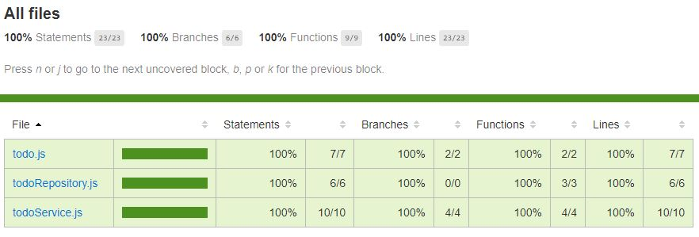

# TDD (Test-driven-development) - Todo List
Projeto de desenvolvimento de uma Todo list, com foco em TDD (Test-driven development), utilizando:
- Mocha
- Nyc (cobertura de codigo)
- Chai
- Sinon (criação de stubs)

100% de code coverage.

## image:

